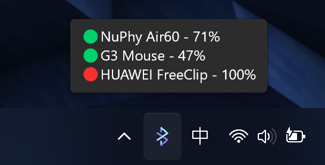
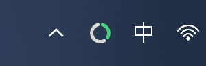
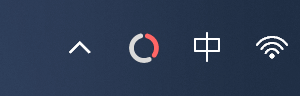
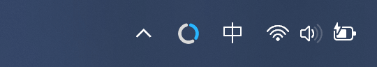
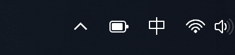
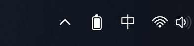

# BlueGauge
A lightweight tray tool for easily viewing the battery level of your Bluetooth devices.

<h3 align="center"> <a href='./README.md'>简体中文</a> | English</h3>

## Function

- [x] Setting：Bluetooth battery level as tray icon  

Use number icon (default)

1. check the device that needs to display the battery    
2. set font: open tray menu -- `Settings` -- `Open Config`   
`font_name` = `"System Font Nmae, e.g. Microsoft YaHei UI"`  
`font_color` = `"Hex color code，e.g. #FFFFFF、#00D26A"` (Default font color follows system theme)  
`font_size` = `0~255` (Default `64`)   
3. restart BlueGauge
4. others: set the icon color to the connection color in `Settings`-`Tray Options` (connected as green, disconnected as red)

    
    

        
        
    

Use ring icon

1. check the device that needs to display the battery    
2. open tray menu - `Settings` - `Tray Options` - `Icon Style` - `Ring Icon`   
3. set color, open tray menu -- `Settings` -- `Open Config`  
`highlight_color` = `"Hex color code，e.g. #4CD082"`( Default green, highlight color turns red when the device battery is low )    
`background_color` = `"Hex color code，e.g. #DADADA"` ( The default gray color is adjusted according to the system theme, and it is not recommended to modify it )   
4. restart BlueGauge  
5. others: set the icon color to the connection color in `Settings`-`Tray Options`   

    

        
        
    

    

Use battery icon

Note: Windows 10 requires downloading and installing the [Segoe Fluent Icons](https://aka.ms/SegoeFluentIcons) font to use this icon

1. check the device that needs to display the battery    
2. open tray menu - `Settings` - `Tray Options` - `Icon Style` - `Battery Icon`   
3. others: set the icon color to the connection color in `Settings`-`Tray Options`   

    

        
        
    

Use custom icon

1. create an `assets` folder in the BlueGauge directory
    - Default：add `0.png` to `100.png`   
    - Follow system theme：In the `assets` folder, create the `dark` and `light` folders respectively, and add `0.png` to `100.png` photos respectively
2. restart BlueGauge  

- [x] Setting：Auto start
- [x] Setting：Bluetooth device name aliases

    1. open tray menu -- `Settings` -- `Open Config`   

    2. Add the required Bluetooth device alias under `[device_aliases]` (note that you use quotation marks to wrap the name)

        - e.g. `"Bluetooth device name" = "Bluetooth alias"`
        - e.g. `"WH-1000XM6" = "Sony Headphones"`
        - e.g. `"Surface Pen" = "Pen"`
        - e.g. `"HUAWEI FreeBuds Pro" = "FreeBuds Pro"`
        - e.g. `"OPPO Enco Air3" = "Enco Air3"`

- [x] Setting: tooltip

    - Shows unconnected devices
    - Truncate devices Name
    - Changing the device power location

- [x] Setting: notice

    - Low battery notice
    - Notification when reconnecting the device
    - Notification when disconnecting the device
    - Notification when adding a new device
    - Notification when moving a new device

## Download: 

[Github](https://github.com/iKineticate/BlueGauge/releases/latest) ( Please download the x86_64 version by default, and download the ARM version for special systems Windows on ARM. )

## Known Issues & Suggested Solutions

### 1. Currently, BlueGauge successfully retrieves battery levels from Bluetooth low-energy devices and Bluetooth Classic devices. However, we are unable to fetch the battery status from devices like AirPods and Xbox controllers, which operate on proprietary communication protocols.

**Solution:**

Welcome contributions from developers who can help us extend support for these devices.

### 2. The character length of tray tooltip is currently limited. When the tooltip text exceeds this limit, it gets truncated, which can result in incomplete device names being displayed. This can cause confusion for users, especially when multiple devices are connected.

**Solution:**

1. **Custom Bluetooth Name**：Shorten the length of the name by giving the Bluetooth name alias.

2. **Limit Device Name Length**: Implement a character limit for device names that ensures they fit within the available space of the tray notification. This may require shortening longer names to prevent truncation.

3. **Hide Disconnected Devices**: Consider not displaying disconnected devices in the tray notifications. This approach would reduce clutter and ensure that only relevant information is shown, thereby preventing text overflow.

### 3. How to display the power of multiple devices on the pallet?

- **Solution:**: Create another folder, copy `BlueGauge.exe` and `BlueGauge.toml` to the folder, then rename `BlueGauge.exe` to another name, and finally turn on and set the display battert level to other Bluetooth device, set the `Launch at Startup`.

### 4. The tray battery number icon is cut off by a small part

- **Solution::**: Open the tray menu - `Settings`-`Open Config`, and then set the font size in `font_size` under `[tray.icon.font]` to set a font that is one size smaller than the original one.

### 5. Connection indicator in tray prompt has no color

Connection indicator only supports displaying colors in Windows 11

- **Solution::**: Open the tray menu - `Settings`-`Open Config`, and then set the font size in `font_size` under `[tray.icon.font]` to set a font that is one size smaller than the original one.

## Other Bluetooth battery display software

 - Supports more devices：

    - [MagicPods](https://apps.microsoft.com/detail/9P6SKKFKSHKM) (**Purchase**)   

    - [Bluetooth Battery Monitor](https://www.bluetoothgoodies.com/) (**Purchase**)   

 - Apple: [AirPodsDesktop](https://github.com/SpriteOvO/AirPodsDesktop)

 - Huawei: [OpenFreebuds](https://github.com/melianmiko/OpenFreebuds)

 - Samsung:

    - [Galaxy Buds](https://apps.microsoft.com/detail/9NHTLWTKFZNB)

    - [Galaxy Buds Client](https://github.com/timschneeb/GalaxyBudsClient)  

- Logitech: [elem](https://github.com/Fuwn/elem)   

- SteelSeries Arctis: [Arctis Battery Indicator](https://github.com/aarol/arctis-battery-indicator)   
